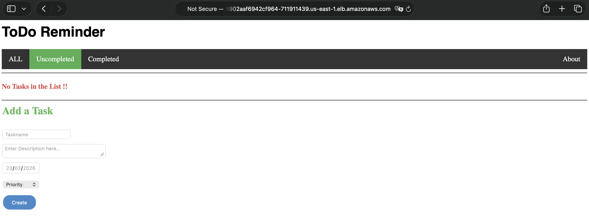
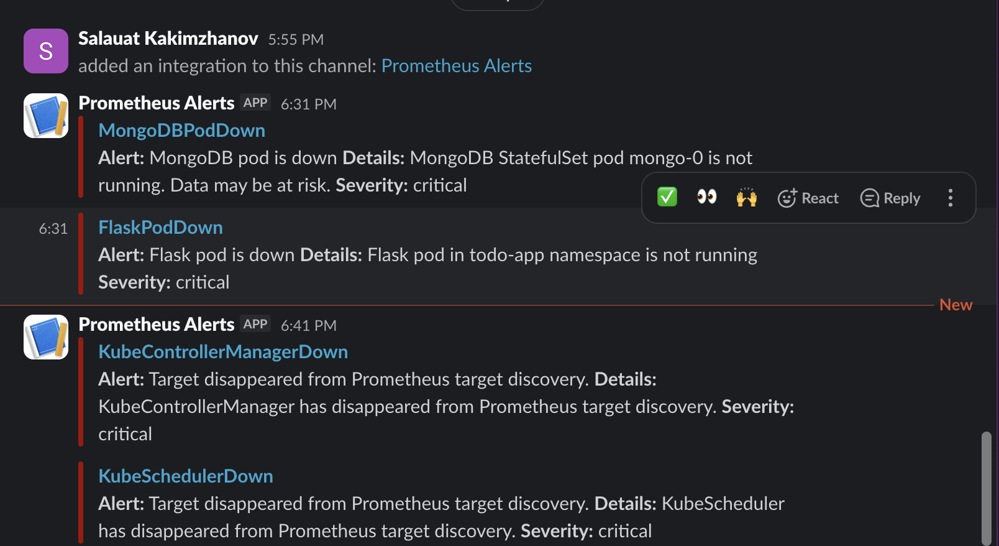

# Cloud Computing Assignment 2
**Student:** Salauat Kakimzhanov | **Course:** Cloud Computing and Big Data Systems — Spring 2026

---

## Part 1 & 2: Application + Docker

Flask + MongoDB To-Do app. Two containers — `salawhaaat/todo-app:latest` (Flask, port 5000, `0.0.0.0`) and `mongo:latest` with a named volume `mongo-data` for persistence.

`docker-compose.yml` used for local testing — defines both services, exposes port 5000, mounts `mongo-data` volume so DB survives restarts.

Image pushed to Docker Hub: `salawhaaat/todo-app:latest`



---

## Part 3 & 4: Minikube → AWS EKS

Same Kustomize manifests work on both. StorageClass differs: Minikube uses default provisioner; EKS uses a custom `ebs-gp3` StorageClass backed by the AWS EBS CSI driver.

**EKS cluster** (`k8s/cluster.yaml`) — `us-east-1`, `t3.medium` (4GB RAM, 2 vCPU), OIDC enabled for IRSA, EBS CSI driver as EKS addon.

`t3.micro` (1GB) and `t3.small` (2GB) were OOMKilled by Prometheus stack — `t3.medium` was the minimum viable size.

```
eksctl create cluster -f k8s/cluster.yaml
```

Flask service exposed as `LoadBalancer` → `a94b3da00459a4a88902aaf6942cf964-711911439.us-east-1.elb.amazonaws.com`

---

## Part 5: ReplicaSets

Flask runs as a `Deployment` (`k8s/components/flask/deployment.yaml`) — stateless, `spec.replicas` controls pod count. Kubernetes automatically recreates pods on deletion, verified with `kubectl get rs`.

MongoDB runs as a `StatefulSet` — stable pod name `mongo-0`, stable PVC `mongo-storage-mongo-0` (5Gi, `ebs-gp3`). Data survives pod deletion.

---

## Part 6: Rolling Update

Flask `Deployment` uses zero-downtime rolling update:
- `maxUnavailable: 0` — old pod stays live until new one passes readiness
- `maxSurge: 1` — one extra pod spun up during transition

Update triggered via `kubectl set image` or editing the deployment YAML with a new image tag.

---

## Part 7: Health Monitoring

| Pod | Probe type | Check | Notes |
|-----|-----------|-------|-------|
| Flask | liveness + readiness | HTTP GET `/` port 5000 | liveness restarts hung pod; readiness gates traffic |
| MongoDB | liveness + readiness | TCP socket port 27017 | `initialDelaySeconds: 30` — gives Mongo time to init |

Kubernetes restarts pods automatically on liveness failure. Readiness prevents traffic until the pod is healthy.

---

## Part 8: Alerting (Extra Credit)

`kube-prometheus-stack` installed via Helm in `monitoring` namespace. Alertmanager routes `critical`/`warning` alerts to Slack `#assignments`.

**Alert rules** (`k8s/components/prometheus/rules.yaml`):

| Alert | Trigger | Severity |
|-------|---------|----------|
| `FlaskPodDown` | No Flask pod running | critical |
| `MongoDBPodDown` | `mongo-0` not running | critical |
| `PodRestartingTooOften` | Restart rate > 0 over 15 min | warning |
| `HighMemoryUsage` | Memory > 80% of limit | warning |

Tested by deleting pods — `FlaskPodDown` and `MongoDBPodDown` both fired and delivered to Slack within ~30 seconds.



---

## Live Cluster State

**Pods:**
```
NAMESPACE    NAME                                                     READY   STATUS
todo-app     flask-app-754bd6dd6b-lm7td                              1/1     Running
todo-app     mongo-0                                                  1/1     Running
monitoring   alertmanager-prometheus-kube-prometheus-alertmanager-0  2/2     Running
monitoring   prometheus-grafana-6fb97bfff8-zrgzx                     3/3     Running
monitoring   prometheus-kube-prometheus-operator-56fbc9995c-xmhlm    1/1     Running
monitoring   prometheus-kube-state-metrics-f47d8dd47-dprm5           1/1     Running
monitoring   prometheus-prometheus-kube-prometheus-prometheus-0      2/2     Running
monitoring   prometheus-prometheus-node-exporter-n7p2t               1/1     Running
```

**Storage:**
```
NAME                    STATUS   CAPACITY   STORAGECLASS
mongo-storage-mongo-0   Bound    5Gi        ebs-gp3
```
